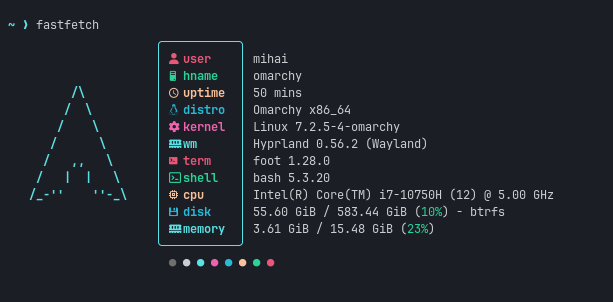
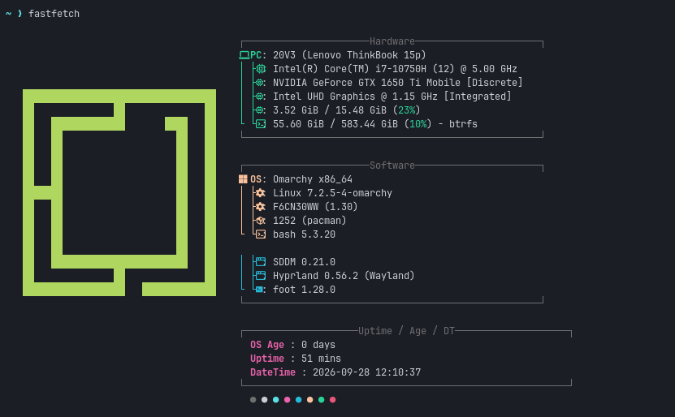

# Dotfiles

Personal Linux configuration, one program per subdirectory.

## What's here

| Config | What it is |
| --- | --- |
| [Hyprland](Hyprland/) | Hyprland configuration and keybindings, written in Lua |
| [Fastfetch](Fastfetch/) | Two `fastfetch` layouts with a script to pick and install one |

## Installing

```sh
git clone https://github.com/nightdevil00/Dotfiles.git
cd Dotfiles
./install.sh
```

`install.sh` copies the files into `~/.config/hypr`. It backs up whatever is
already there to a timestamped directory first, so it is safe to run on a
machine you have already configured:

```sh
./install.sh --dry-run    # show what would change, write nothing
./install.sh --force      # skip the backup
```

Re-running is safe — identical files are reported as unchanged and skipped.

Then apply the config without logging out:

```sh
hyprctl reload
```

## Hyprland

| File | Purpose |
| --- | --- |
| `hyprland.lua` | Entry point; loads the rest and decides what to source from where |
| `bindings.lua`, `bindings/` | Keybindings, split by area — applications, clipboard, media, tiling, utilities, voxtype |
| `autostart.lua` | Extra autostart processes; ships empty with a commented `o.launch_on_start("my-service")` to copy |
| `monitors.lua` | Monitor, mode, scale, position and transform |
| `windows.lua` | Window rules and per-app behaviour |
| `input.lua` | Keyboard, touchpad, mouse and stylus settings |
| `looknfeel.lua` | Cursor, focus, border and misc feel |
| `animations.lua` | Window and workspace animations |
| `nvidia.lua` | NVIDIA-specific settings |
| `settings.lua` | Miscellaneous settings |
| `xdph.conf`, `hyprsunset.conf` | XWayland and blue-light / night light configuration |

The config is written against [hyprland-lua](https://github.com/hyprwm/hyprland-lua)
and layers over an [Omarchy](https://omarchy.org/) base install.
`.luarc.json` is editor metadata for Lua tooling, not part of the config.

## Fastfetch

Two `fastfetch` layouts and a script to pick between them. It has its own
installer in [Fastfetch/](Fastfetch/), so the root `install.sh` above stays
Hyprland-only.

| File | Purpose |
| --- | --- |
| `config1.jsonc` | Minimal layout — one bordered column beside a small ASCII logo, every label its own colour |
| `config2.jsonc` | Sectioned layout — Hardware / Software / Uptime-Age-DateTime panels, one key colour per section |
| `config1.png`, `config2.png` | Screenshots of each layout |
| `install.sh` | Picks a config and copies it to `~/.config/fastfetch/config.jsonc` |

```sh
git clone https://github.com/nightdevil00/Dotfiles.git
cd Dotfiles/Fastfetch
./install.sh          # pick 1 or 2 from the menu
./install.sh 2        # or pass the number directly
```

It creates `~/.config/fastfetch/` if it doesn't exist, copies the chosen config
to `config.jsonc`, and backs up any existing config to a timestamped
`config.jsonc.bak.*` first. Then run `fastfetch` to try it out.

Both layouts use Nerd Font icons, so your terminal font needs to be a Nerd Font
— JetBrainsMono Nerd Font, MesloLGS NF, Iosevka Term and similar.





`config2` is based on [a config by u/aayush-le](https://www.reddit.com/r/GarudaLinux/comments/1dcq0dl/making_fastfetch_more_beautiful_linux/).
More detail, including what to tweak when editing, is in
[Fastfetch/README.md](Fastfetch/README.md).
